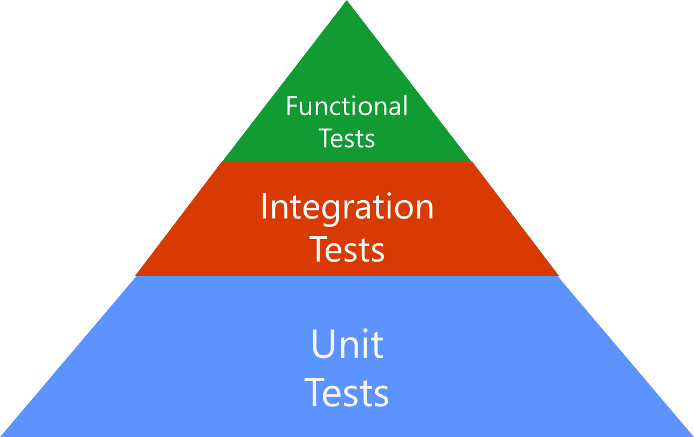

# Weather Forecast Api

This repository have the pourpose of training my team in building effective tests and pass through some issues we find during the development, such as mapping errors, dependency injection, logical error, test implementation not following business and more.

Basically the application consists of consumming the [MetaWeather API](https://www.metaweather.com/api/) to get the weather by location and convert the results for the desired thermometric scale.

The tests are distributed in three layers of the bottom of the original test pyramid drawn by Martin Fowler. Follow the links for more information.

- [Test pyramid](https://martinfowler.com/bliki/TestPyramid.html)
- [Test pyramid applied to .Net](https://docs.microsoft.com/en-us/dotnet/architecture/modern-web-apps-azure/test-asp-net-core-mvc-apps)



### Running the application

Run command inside the api project folder:

```
dotnet run
```

### Running the tests

Run command on the root folder or inside a test project folder:

```
dotnet test
```

### Running the mutation tests

If you don't have dotnet-stryker installed, go to the root of the project and run:

```
dotnet tool restore
```

On WeatherForecast/tests/WeatherForecast.UnitTest run:

```
dotnet stryker --project-file=[projectfile]
```

### Built with

- [.NET Core 3.1](https://dotnet.microsoft.com/download/dotnet-core/3.1) - _Software Developmet Kit (SDK)_
- [xUnit.net](https://xunit.net/) - _Unit Test Framework_
- [Fluent Assertions](https://fluentassertions.com/) - _Unit Test Assertions Extension Methods_
- [Moq](https://github.com/moq/moq4) - _The most popular mocking library for .NET_
- [WireMock](https://github.com/WireMock-Net/WireMock.Net) - _A flexible library for stubbing and mocking web HTTP responses_
